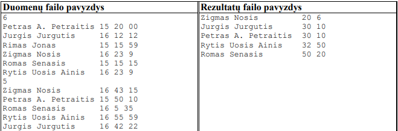
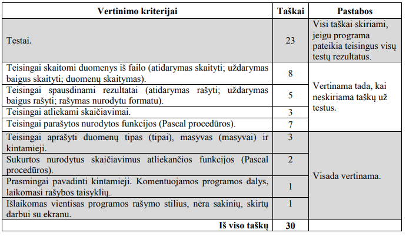

# 2018 m. valstybinio brandos egzamino užduotis

## 2 užduotis. Slidininkai

Slidininkai 10 km rungtyje startuoja pagal atrankos etapo rezultatus. Slidininkas startuoja tiek laiko vėliau už lyderį, kiek laiko nuo jo yra atsilikęs. 

Parašykite programą, kuri pateiktų slidininkų rezultatų sąrašą pagal trasoje sugaištą laiką didėjančiai. 

Per vienodą laiką nušliuožę slidininkai turi būti rašomi abėcėliškai pagal simbolių eilutę, kurioje yra slidininką identifikuojanti informacija.

__Pradiniai duomenys__

Duomenys pateikiami tekstiniame faile Duomenys.txt. Visi skaičiai yra sveikieji.

Duomenų faile įrašyta:
- Pirmoje eilutėje užrašytas startuojančių slidininkų skaičius n (1 ≤ n ≤ 30).
- Tolesnėse n eilučių atsitiktine tvarka surašyti slidininkų starto duomenys. Kiekvieno slidininko duomenys užrašyti atskiroje eilutėje: pirmose 20 pozicijų yra simbolių eilutė, kurioje pateikta slidininką identifikuojanti informacija; po to starto laikas: valanda, minutė ir sekundė, atskirtos vienu tarpo simboliu.
- Toliau užrašytas finišavusių slidininkų skaičius m (1 ≤ m ≤ 30).
- Tolesnėse m eilučių surašyti slidininkų finišo duomenys. Kiekvieno slidininko duomenys užrašyti atskiroje eilutėje: pirmose 20 pozicijų yra simbolių eilutė, kurioje pateikta slidininką identifikuojanti informacija; po to finišo laikas: valanda, minutė ir sekundė, atskirtos vienu tarpo simboliu.

__Rezultatai__

Rezultatus įrašykite tekstiniame faile Rezultatai.txt

- Vienoje eilutėje užrašykite vieno slidininko duomenis: pirmose 20 pozicijų – simbolių eilutę, kurioje pateikta slidininką identifikuojanti informacija, atskirta vienu tarpo simboliu, po to slidininko rezultatas: minutės ir sekundės, atskirtos vienu tarpo simboliu. 10 km rungtyje maksimalus slidininko sugaištas laikas yra ne daugiau kaip valanda. Jeigu slidininkas nepasiekė finišo (jo nėra finišavusiųjų sąraše), tai rezultatų sąraše jo neturi būti.
- Rezultatai turi būti surikiuoti pagal trasoje sugaištą laiką didėjančiai. Per vienodą laiką nušliuožę slidininkai rašomi abėcėliškai pagal simbolių eilutę, kurioje yra slidininką identifikuojanti informacija.

__Nurodymai__
- Sukurkite ir parašykite funkciją, kuri surikiuoja rezultatus.

__Duomenų ir rezultatų pavyzdžiai__
 
 

__Programos vertinimas__
 
 

